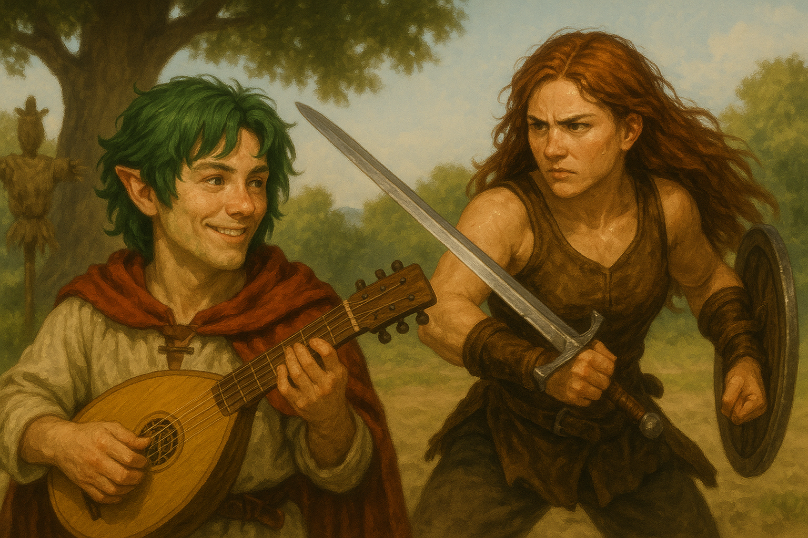

[Dump do banco em csv](./memories.csv)

---

# 📜 A Canção e a Espada

---

## O Treino Silencioso

O sol da manhã iluminava o pátio de treino. Chiara, de cabelos soltos e suor perlado na fronte, golpeava espantalhos com a firmeza de uma guerreira que carregava não apenas aço, mas também fardos invisíveis. A espada longa cortava o ar com estalos secos, enquanto o escudo de madeira bloqueava ataques imaginários.

Cada golpe era uma promessa feita a si mesma.
Cada defesa, uma lembrança de que jamais permitiria ser frágil novamente.

Mas havia olhos que a observavam.

À sombra de uma árvore próxima, Drakaw — o bardo meio-dragão — deixava que seus olhos se perdessem na cadência dos movimentos dela. Admirava não só a força, mas o silêncio. Um silêncio que o intrigava, o desafiava… e o atraía.

## A Serenata de Drakaw

Incapaz de apenas olhar, Drakaw pegou o alaúde. Dedilhou as cordas e deixou que versos escapassem:

> “És mais bela que as ninfas da floresta,
> mais radiante que o reflexo das Valquírias nos lagos cristalinos.
> Oh, Chiara, a mais bela de todas!”

A melodia, suave e envolvente, espalhou-se pelo ar.
Mas Chiara, focada em seu treino, parecia não escutar.

Frustrado e, ao mesmo tempo, instigado, Drakaw decidiu ir além.
Encantou espantalhos para que movessem-se contra ela, transformando o exercício em combate real. As pedras ao redor começaram a flutuar sob sua magia, zunindo como vespas prontas para atacar. Até flores se tornaram versos de sua cortejada: uma rosa encantada deslizou pelo ar em direção a Chiara, seu perfume adocicando o ambiente.

E, ainda assim, Chiara permanecia concentrada.

## Entre Romance e Provocação

O silêncio dela era uma muralha.
Drakaw, dividido entre a paixão e a vaidade ferida, alternava entre cantos românticos e provocações ardilosas.

— “Chiara, você é linda!” — declarou, com a voz firme, aproximando-se.

Ela nada respondeu.
Os espantalhos dançavam, as pedras ricocheteavam no escudo, mas sua boca não se abria.

Drakaw riu.
— “Você fez algum voto de silêncio, minha guerreira?”

E então ousou. Usou a canção para distrair, para atordoar… até que, em um descuido, tentou-lhe um beijo.
Foi um toque súbito, impulsivo, carregado de desejo. E por um instante, o mundo pareceu silenciar-se — apenas os corações pulsavam — mas ela desviou da surpresa.

Chiara, porém, não se deixou perder no gesto. Continuou a lutar, como se o beijo fosse apenas mais um golpe a aparar.

## ⚔️ O Desafio

Drakaw já não suportava mais o silêncio.
Havia observado, cantado, encantado espantalhos, flores e pedras — mas Chiara permanecia implacável em seu treino. O suor brilhava em sua pele, e cada golpe era desferido como se o mundo ao redor simplesmente não existisse.

Com a voz embargada entre paixão e provocação, ele lançou o desafio:

— “Se eu te vencer, você será minha por uma noite.”

A frase ecoou pelo pátio como trovão.

## O Confronto dos Encantamentos

Chiara ergueu os olhos pela primeira vez. Seu olhar faiscante encontrou o dele, mas em vez de palavras, respondeu com a espada: desferiu golpes contra o espantalho à sua frente, desfazendo-o em palha e estilhaços.

Drakaw sorriu.
Com um acorde grave no alaúde, o boneco caído se reergueu, junto de outro que surgiu sob seu comando. Dois espantalhos avançaram contra Chiara, agora não mais inertes, mas dançando ao ritmo da canção do bardo.

Pedras próximas começaram a girar no ar, zunindo como um enxame de abelhas de rocha. Os troncos ao redor tremeram e se ergueram, chicoteando em sincronia com os acordes. Era como se todo o campo de treino tivesse se tornado uma orquestra de guerra sob a batuta de Drakaw.

Chiara bloqueava e desviava com seu escudo e espada. O impacto das pedras contra o escudo soava como tambores, os golpes de sua lâmina partiam troncos e palha, mas o bardo renovava a ofensiva, rindo e cantarolando versos provocativos.

## A Canção da Guerra

— “Se não é pelos cantos de beleza e romance, como as ninfas e dríades que te invejam...” — Drakaw entoou, a voz misturada à melodia.
— “Então será pelos cantos de guerra!”

Ao som de sua canção, os dois espantalhos investiram contra Chiara, seguidos por uma rajada de pedras e troncos. O treino virou batalha real.

Ela girou, aparando golpes, destruindo novamente as criaturas encantadas — apenas para vê-las se recompor sob o feitiço. O ar estava carregado, cada nota do alaúde trazia mais obstáculos, cada golpe de Chiara era uma resposta feroz.

## O Clímax

Finalmente, Drakaw concentrou sua magia em uma rajada brutal: pedras e troncos choveram sobre Chiara em sequência, como uma tempestade calculada para desgastá-la. Por último, lançou os espantalhos sobre o corpo dela, forçando-a a resistir com toda a força de guerreira.

Ofegante, o cabelo grudado ao rosto pelo suor, Chiara manteve-se firme, bloqueando e resistindo até que, exausta, parou diante dele.

Drakaw, agora em silêncio, aproximou-se.
O alaúde repousava contra o peito, pronto para um último acorde, mas não o tocou.
A batalha havia acabado — não porque ele a vencera com feitiços, mas porque a guerra se transformara em algo mais íntimo.

Chiara respirou fundo. Sua espada ainda firme, mas sua voz enfim quebrou a barreira:

— “Sobre nós…”

Essas duas palavras fizeram cair todos os encantamentos. Os espantalhos ruíram, as pedras despencaram, os troncos tombaram.
Drakaw a encarou, maravilhado: ele havia conseguido o impossível.
Não vencera com golpes ou magia, mas com sua insistência — e com a coragem de expor sua própria vulnerabilidade.

## O Diálogo

Agora frente a frente, já sem espadas nem magia, os dois se permitiram conversar. Drakaw admitiu seus sentimentos, seu esforço em ser notado, suas horas de serenata. Chiara, por sua vez, abriu o coração sobre a disciplina, sobre os medos que a prendiam à espada e a afastavam da voz.

O bardo então riu suavemente e a convidou:

— “Vamos à taverna esta noite. Quero ouvir tua voz, não apenas o som do aço.”

Chiara hesitou, mas sorriu. Um sorriso breve, quase imperceptível — mas real.

## Epílogo

Entre versos e lâminas, entre provocações e beijos roubados, uma ponte foi construída.
Não era a vitória de um sobre o outro, mas o encontro de duas forças:
a canção do bardo e a disciplina da guerreira.

Naquela manhã, Drakaw descobriu que não era preciso vencer para conquistar.
E Chiara, por fim, percebeu que até no treino mais solitário, havia espaço para a música e para o diálogo.

---

## ✍️ Notas do Autor
1. As memórias exportadas do banco de dados já contêm persistência que dura entre sessões.  
2. A história foi reconstruída a partir dos dados, mas parte da narrativa inicial se perdeu.  
3. O grande avanço nesta forma de contar a história foi que:  
   - **3.a** Trouxe todo o sistema de *agentificação* e criação de personagens usando o processo `God`.  
   - **3.b** Incorporou suporte a CLI e música em background no terminal.  
   - **3.c** Implementou a narrativa colaborativa usando agentes no `mode: llm` e no `mode: manual`.  
4. É com alegria que registro os avanços nesses experimentos — eles me permitiram ficar horas entretido de uma forma que fazia muito tempo não acontecia.  
